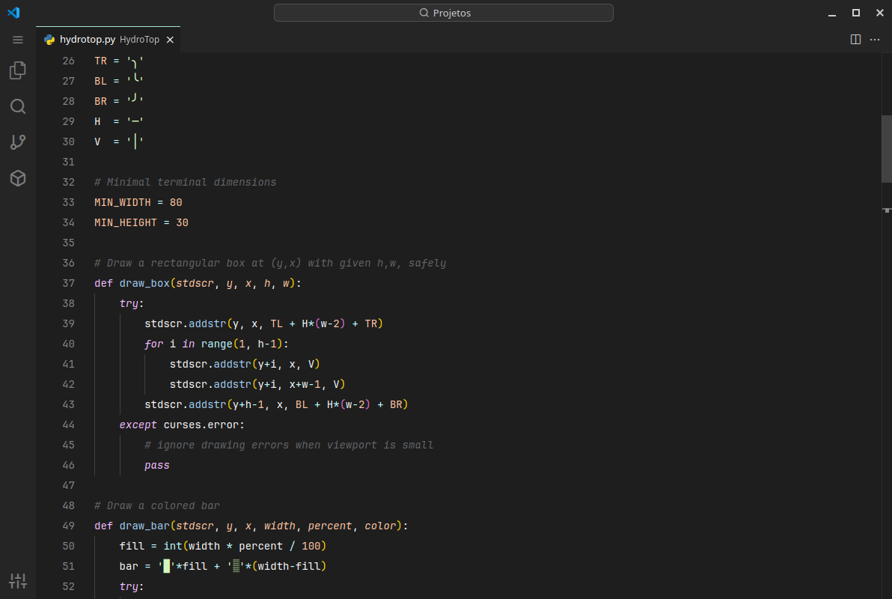
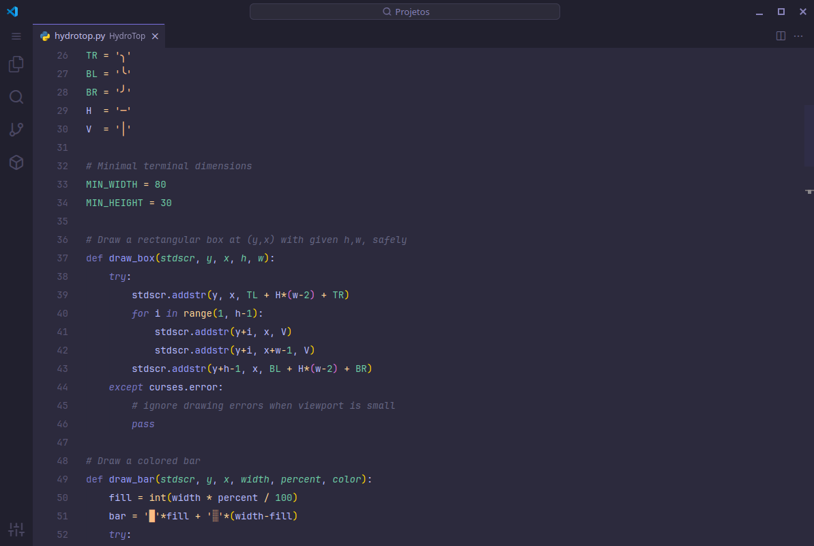

# Neo+ Theme Pack

A refined duo of dark themes for Visual Studio Code — combining smoother contrast, elegant colors, and a comfortable coding experience.

This pack includes:

- **Neodark+**: A modernized take on the classic Dark+ theme, with reduced visual noise and enhanced readability.
- **Neokai**: A soft, ambient dark theme inspired by material tones and Monokai, perfect for focused, distraction-free coding.
- **Neospace**: a simple and soft theme in a space aesthetic.

Designed to feel familiar yet fresh, these themes bring a balanced, beautiful look to your workspace.

---

